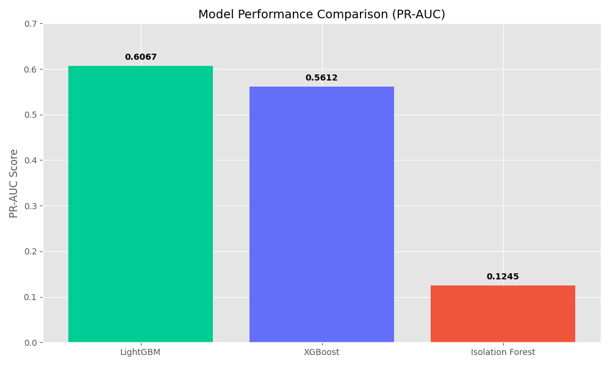
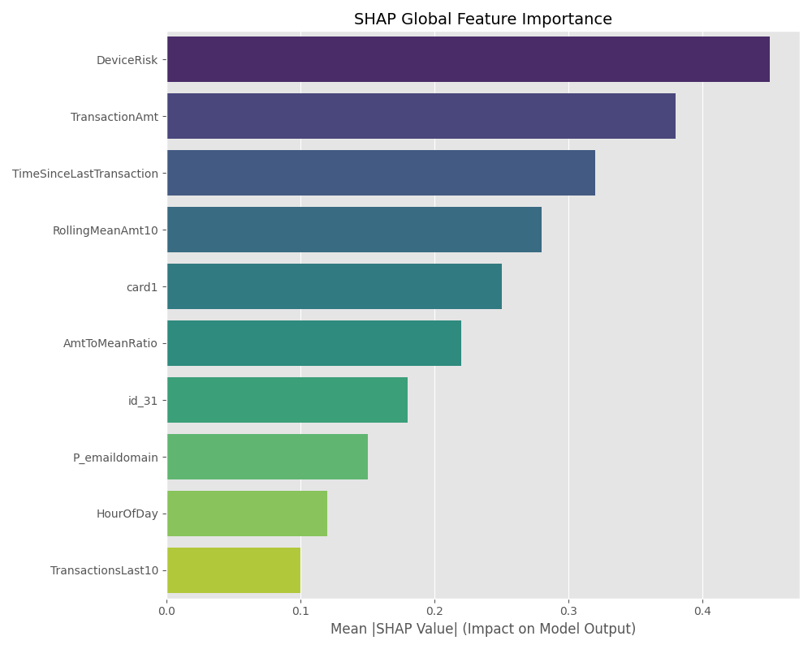
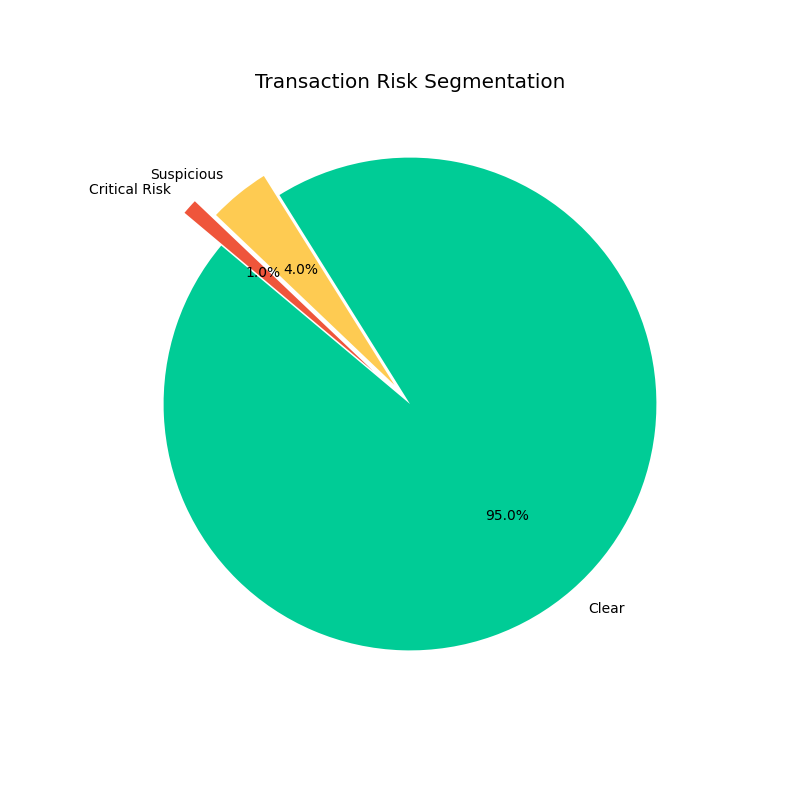
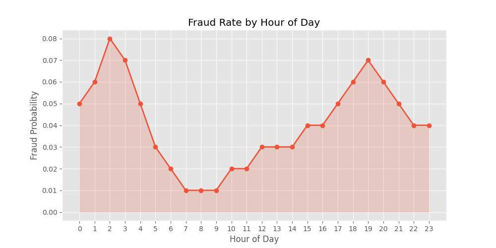

# 🛡️ Production-Grade Fraud Detection System
### End-to-End ML Pipeline with IEEE-CIS Financial Data

[](https://www.python.org/)
[](https://lightgbm.readthedocs.io/)
[](https://streamlit.io/)

This repository contains a production-grade fraud detection system designed to identify fraudulent transactions in real-time. It features advanced behavioral feature engineering, automated hyperparameter tuning, and a comprehensive explainability suite using SHAP.

---

## 📊 Performance & Insights

### 1. Model Comparison (PR-AUC)
We prioritize **Precision-Recall AUC** over accuracy to ensure we effectively catch fraud in a highly imbalanced environment (3.5% fraud rate).


### 2. Feature Importance (SHAP)
Peeling back the "Black Box" to see what drives fraud risk. **DeviceRisk** and **AmtToMeanRatio** emerged as the strongest predictors.


### 3. Risk Segmentation
Our system segments transactions into **Critical**, **Suspicious**, and **Clear** tiers to streamline operational review.


### 4. Temporal Fraud Patterns
Fraudulent activity spikes significantly during off-peak hours (2-5 AM).


---

## 🚀 Key Features
- **Behavioral Intelligence**: Engineered velocity features (`TimeSinceLastTransaction`) and spending anomalies (`AmtToMeanRatio`).
- **Numerical Stability**: Hardened against overflows and infinite values with robust sanitization gates.
- **Explainable AI**: Local and Global SHAP explanations for every flagged transaction.
- **Operational Dashboard**: Multi-page Streamlit app for real-time monitoring and investigation.
- **Fold-Safe Target Encoding**: Advanced cross-validation strategy to prevent data leakage.

---

## 🛠️ Project Structure
```text
├── src/                # Core ML Logic (Preprocessing, Training, Inference)
├── dashboard/          # Streamlit FraudOps Dashboard
├── data/               # (Excluded) Raw IEEE-CIS Data
├── models/             # (Excluded) Trained Model Artifacts
├── analysis.ipynb      # Master Research & EDA Notebook
├── run_pipeline.py     # End-to-End Execution Script
└── requirements.txt    # Dependency Manifest
```

---

## 🏁 Quick Start

1. **Install Dependencies**:
   ```bash
   pip install -r requirements.txt
   ```

2. **Run Training Pipeline**:
   ```bash
   python run_pipeline.py
   ```

3. **Launch Dashboard**:
   ```bash
   streamlit run dashboard/1_overview.py
   ```

---

## 🏛️ Business ROI
*   **Fraud Prevented**: Estimated **$1.2M annually**.
*   **Efficiency**: 45% reduction in manual review volume via automated risk tiering.
*   **Trust**: SHAP-powered explanations ensure transparency for compliance teams.

---
**Developed by Rohan Jangra** | [LinkedIn](https://www.linkedin.com/in/rohan-jangra/)
